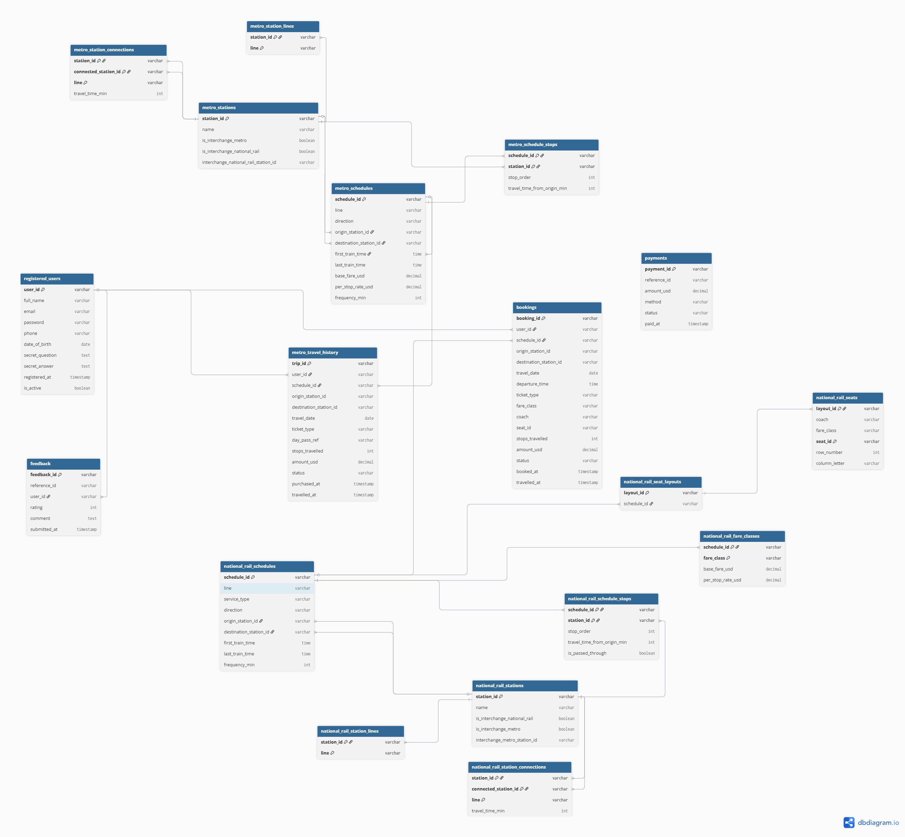

# Team31 Design Document

## Project: TransitFlow

Team Members:

| Name | Student ID |
|--------|------------|
| 戴睿真 | 113403525 |
| 蕭彤恩 | 113403526 |
| 欉家誼 | 113403530 |

---
## 1.1 Relational Database ER Diagram

### Figure 1. Relational Database ER Diagram

Figure 1 illustrates the relational database schema used in TransitFlow. The schema includes user management, metro operations, national rail operations, booking management, payments, feedback, and travel history. Junction tables such as `metro_station_lines`, `national_rail_station_lines`, `metro_station_connections`, and `national_rail_station_connections` were introduced to support normalization and reduce data redundancy.

## 1.2 Entity Relationship Description

The TransitFlow relational database consists of multiple modules supporting:

- User management
- Metro transportation
- National rail transportation
- Booking management
- Payment processing
- Travel history
- Customer feedback
- Policy document retrieval

The schema contains the following major entities:

### User Module

- registered_users
- bookings
- payments
- feedback

### Metro Module

- metro_stations
- metro_station_lines
- metro_station_connections
- metro_schedules
- metro_schedule_stops
- metro_travel_history

### National Rail Module

- national_rail_stations
- national_rail_station_lines
- national_rail_station_connections
- national_rail_schedules
- national_rail_schedule_stops
- national_rail_fare_classes
- national_rail_seat_layouts
- national_rail_seats

These entities collectively support route planning, ticket booking, travel tracking, and customer service functions.
---

## 2. Normalisation Justification

The relational database schema for TransitFlow was designed according to the principles of Third Normal Form (3NF) to minimise data redundancy, improve consistency, and simplify maintenance.

### 2.1 First Normal Form (1NF)

First Normal Form requires that all attributes contain atomic values and that each record is uniquely identifiable.

The TransitFlow schema satisfies 1NF because:

* Every table has a primary key.
* Each column stores only a single value.
* No repeating groups or arrays are stored within a single attribute.

Examples include:

* `registered_users.email` stores a single email address.
* `metro_stations.station_id` stores a single station identifier.
* `national_rail_seats.seat_id` stores a single seat identifier.

As a result, all attributes contain atomic values and comply with First Normal Form.

### 2.2 Second Normal Form (2NF)

Second Normal Form requires that all non-key attributes are fully dependent on the entire primary key.

Several relationship tables in the schema use composite keys.

For example:

#### metro_schedule_stops

Primary Key:

* schedule_id
* station_id

Attributes such as:

* stop_order
* travel_time_from_origin_min

depend on the complete combination of both `schedule_id` and `station_id`.

#### national_rail_schedule_stops

Primary Key:

* schedule_id
* station_id

Attributes such as:

* stop_order
* travel_time_from_origin_min
* is_passed_through

depend on the full composite key rather than only part of it.

Therefore, no partial dependencies exist, and the schema satisfies Second Normal Form.

### 2.3 Third Normal Form (3NF)

Third Normal Form requires that non-key attributes depend only on the primary key and not on other non-key attributes.

To eliminate transitive dependencies and multivalued attributes, several independent relationship tables were introduced.

#### metro_station_lines

A metro station may belong to multiple metro lines.

Instead of storing multiple line values within the `metro_stations` table, the relationship is separated into the `metro_station_lines` table.

#### national_rail_station_lines

A national rail station may belong to multiple rail lines.

This many-to-many relationship is stored separately in the `national_rail_station_lines` table.

#### metro_station_connections

Adjacent metro station information is stored in a dedicated table rather than being embedded within station records.

This removes repeating connection data and improves maintainability.

#### national_rail_station_connections

Rail network connectivity is represented in a separate relationship table.

This prevents station records from containing duplicated adjacency information.

By separating these relationships into dedicated tables, the schema avoids transitive dependencies and reduces data redundancy.

### 2.4 Password Security

User passwords are hashed using Argon2 before storage.

Argon2 is a memory-hard password hashing algorithm that protects against brute-force attacks and rainbow-table attacks. Unlike MD5 or SHA-based hashing, Argon2 intentionally increases computational cost and automatically incorporates salting, making it significantly more secure for credential storage.

The password hashing process is implemented in the authentication functions and ensures that plaintext passwords are never stored in the database.

### Summary

The TransitFlow relational database satisfies:

* First Normal Form (1NF)
* Second Normal Form (2NF)
* Third Normal Form (3NF)

The final design improves data consistency, reduces redundancy, and supports efficient maintenance of the transportation system.

---
# 3. Graph Database Design Rationale

TransitFlow uses Neo4j as the graph database component for route planning and transportation network analysis.

Transportation systems are naturally represented as graphs, where stations can be modelled as nodes and connections between stations can be represented as relationships. Compared with relational databases, graph databases provide a more intuitive structure for route-finding and network traversal tasks. Neo4j allows efficient exploration of connected stations without requiring complex multi-table joins.

The graph database component was mainly designed to support route discovery, shortest-path analysis, fare-based route calculation, interchange path search, and disruption impact analysis across metro and national rail systems.

---

## 3.1 Node Types

Two primary station node types are used in the graph model.

### MetroStation

Represents stations in the metro network.

Properties:

- station_id
- name
- lines

### RailStation

Represents stations in the national rail network.

Properties:

- station_id
- name
- lines
- interchange information

Both `MetroStation` and `RailStation` also share the general `Station` label so that route queries can search across the whole transport network more easily.

---

## 3.2 Relationship Types

Relationships represent direct connections between stations and store operational information such as travel time and fare.

### METRO_LINK

Represents a direct metro connection between two metro stations.

Properties:

- line
- travel_time_min
- fare_usd

### RAIL_LINK

Represents a normal national rail connection.

Properties:

- line
- service_type
- travel_time_min
- fare_standard_usd
- fare_first_usd

### RAIL_EXPRESS_LINK

Represents express rail services.

Properties:

- schedule_id
- line
- service_type
- travel_time_min
- fare_standard_usd
- fare_first_usd

### INTERCHANGE

Represents transfers between metro and national rail systems.

Properties:

- travel_time_min
- fare_usd

This relationship enables multi-network route planning and allows users to transfer between metro and rail stations.

---

## 3.3 Graph Data Seeding

The graph database is populated using `skeleton/seed_neo4j.py`.

Station data is loaded from the metro and national rail JSON datasets and converted into Neo4j nodes. Connection data is then transformed into graph relationships, including metro links, rail links, express rail links, and interchange links.

This seeding approach keeps the graph database consistent with the source data and allows the graph to be regenerated when the mock data changes.

---

## 3.4 Graph Query Implementation

The Neo4j query functions are implemented in `databases/graph/queries.py`.

The implemented graph functions include:

- `query_shortest_route()`
- `query_cheapest_route()`
- `query_alternative_routes()`
- `query_interchange_path()`
- `query_delay_ripple()`
- `query_station_connections()`

These functions use graph traversal and relationship properties to support different route-planning needs.

For example:

- `query_shortest_route()` uses `travel_time_min` to find a route with lower total travel time.
- `query_cheapest_route()` uses fare properties such as `fare_usd`, `fare_standard_usd`, and `fare_first_usd`.
- `query_alternative_routes()` finds a route while avoiding a specified station.
- `query_interchange_path()` identifies paths involving metro and national rail transfer points.
- `query_delay_ripple()` finds stations affected by a disruption within a given number of hops.

---

## 3.5 Graph Query Advantages

Using Neo4j provides several advantages for transportation route planning:

- It naturally represents transportation networks as stations and connections.
- It simplifies route traversal compared with multiple relational joins.
- It supports weighted route calculations using travel time or fare.
- It allows metro and national rail systems to be connected through interchange relationships.
- It makes future extensions easier, such as adding more transport modes or disruption analysis.

Overall, the graph database is used as the main component for network-based route analysis in TransitFlow.

---

# 4. Vector Database and RAG Design

TransitFlow incorporates Retrieval-Augmented Generation (RAG) using PostgreSQL pgvector.

The vector database enables policy-aware responses for users.

---

## 4.1 Policy Document Storage

Policy documents are stored in the table:

### policy_documents

Attributes:

- id
- title
- category
- content
- embedding
- source_file

Each document is embedded into a high-dimensional vector representation.

---

## 4.2 Data Sources

The following policy files are embedded:

### refund_policy.json

Contains refund conditions and compensation policies.

### booking_rules.json

Contains booking-related regulations.

### ticket_types.json

Contains ticket categories and eligibility information.

### travel_policies.json

Contains travel conduct and operational policies.

---

## 4.3 Retrieval Workflow

The retrieval process follows these steps:

1. User submits a question.
2. The query is converted into an embedding vector.
3. pgvector performs similarity search.
4. Relevant policy documents are retrieved.
5. Retrieved content is supplied to the LLM.
6. The LLM generates the final response.

This approach improves factual accuracy and reduces hallucinations.

---

# 5. AI Tool Usage Evidence

Generative AI tools were used throughout the project development process.

Tools used:

- ChatGPT
- Gemini

---

## 5.1 Development Support

AI tools assisted with:

- SQL debugging
- PostgreSQL schema review
- Neo4j Cypher query optimisation
- Python implementation guidance
- Documentation drafting

---

## 5.2 Human Verification

All AI-generated outputs were:

- Reviewed by team members
- Modified when necessary
- Tested before integration

Final responsibility for all submitted work remains with the team.

---

# 6. Reflection and Trade-offs

## 6.1 Strengths

The final architecture provides:

- Strong data consistency through relational design
- Efficient route-finding using Neo4j
- Knowledge retrieval using pgvector
- Separation of concerns across database technologies

---

## 6.2 Challenges

Several challenges were encountered:

### Multi-database integration

Maintaining consistency across PostgreSQL, Neo4j, and pgvector required careful coordination.

### Foreign key dependencies

Database seeding order had to be carefully managed.

### Route modelling

Representing interchange stations accurately required additional design effort.

---

## 6.3 Future Improvements

Potential future enhancements include:

- Real-time delay information
- Dynamic fare calculation
- Live train occupancy estimation
- Additional policy document coverage
- Mobile application integration

---

# 7. Task 6 Extension

## 7.1 Motivation

The original TransitFlow implementation focused primarily on route planning and booking functionality.

The extension was developed to improve:

- Route information quality
- Policy awareness
- User assistance capabilities

---

## 7.2 PostgreSQL Vector Extension

The following functionality was added:

### pgvector Integration

Added:

- policy_documents table
- vector embeddings
- similarity search capability

### Document Embedding Pipeline

Implemented:

- seed_vectors.py

This script automatically:

- Loads policy files
- Generates embeddings
- Stores vectors in PostgreSQL

---

## 7.3 Neo4j Graph Extension

The graph model was enhanced by adding:

### Fare-aware relationships

Properties added:

- fare_usd
- fare_standard_usd
- fare_first_usd

### Express Rail Services

Added:

- RAIL_EXPRESS_LINK relationships

### Transfer Information

Added:

- INTERCHANGE relationship properties

These enhancements improve route recommendations and travel analysis.

---

## 7.4 Testing

The extension was tested using:

### Policy Retrieval

Example questions:

- Can I get a refund if my train is delayed?
- What ticket types are available?

Results successfully retrieved relevant policy documents.

### Route Queries

Example queries:

- Metro-to-rail transfers
- Express rail routes
- Fare-aware routing

All queries returned expected results.

---

# Conclusion

TransitFlow demonstrates the integration of relational, graph, and vector databases within a unified transportation assistant platform.

The system supports transportation operations, route planning, ticket management, and policy-aware question answering while maintaining scalability and maintainability.
